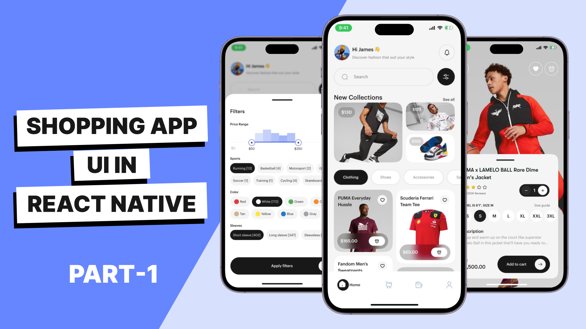

# React Native GLX App UI

Olá pessoal 👋

Neste tutorial em vídeo, vou implementar esta incrível interface de aplicativo de compras 😍. É uma interface moderna com muitos elementos de layout para brincar, e você aprenderá muito ao implementar esta interface em React Native. Ela possui layouts de grade, uma lista em estilo alvenaria, uma folha inferior, fundo desfocado e muitas coisas interessantes. Esta é uma interface perfeita para você praticar.

Vamos aprender como implementar a navegação em React com TypeScript e navegação aninhada 😎, como usar o React Native Reanimated 🔥, como adicionar uma visualização de lista em estilo alvenaria no React Native 🖼️, como adicionar um layout de grade no React Native 🚀 e também um tema personalizado 🎨.

Espero que você ache este tutorial de interface de compras em React Native útil e que aprenda muitas coisas com este vídeo.
